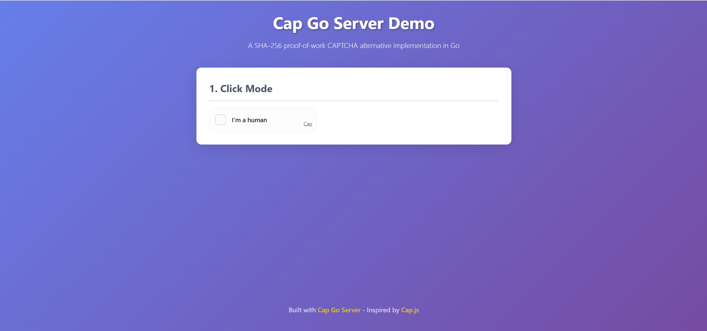

# Cap Go Server

A Go implementation of Cap - a lightweight, modern open-source CAPTCHA alternative using SHA-256 proof-of-work.

## Overview



Cap Go Server is a Go port of the original JavaScript Cap server library. It provides server-side challenge generation and verification for Cap, a proof-of-work based CAPTCHA alternative that eliminates the need for tracking, fingerprinting, or data collection.

## Features

- **Proof-of-Work Based**: Uses SHA-256 proof-of-work instead of complex puzzles
- **Privacy-Focused**: No tracking, fingerprinting, or data collection required
- **Lightweight**: Minimal dependencies and efficient implementation
- **Configurable**: Customizable challenge difficulty, expiration times, and storage options
- **Token Management**: Secure token generation, validation, and cleanup
- **File-based Persistence**: Optional file-based token storage with automatic cleanup

## Installation

```bash
go get github.com/samwafgo/cap_go_server
```

## Quick Start

### Basic Usage

```go
package main

import (
    "fmt"
    "github.com/samwafgo/cap_go_server"
)

func main() {
    // Initialize Cap server with default configuration
    config := &capserver.CapConfig{
        TokensStorePath: "./tokens.json",
        NoFSState:       false,
    }
    cap := capserver.New(config)

    // Create a challenge
    challengeConfig := &capserver.ChallengeConfig{
        ChallengeCount:      50,
        ChallengeSize:       32,
        ChallengeDifficulty: 4,
        ExpiresMs:           300000, // 5 minutes
        Store:               true,
    }
    
    challenge, err := cap.CreateChallenge(challengeConfig)
    if err != nil {
        fmt.Printf("Error creating challenge: %v\n", err)
        return
    }
    
    fmt.Printf("Challenge created with token: %s\n", challenge.Token)
}
```

### HTTP Server Example

1. **Start the server**:
   ```bash
   cd example/http_server
   go run main.go
   ```

2. **Open your browser**:
   Navigate to `http://localhost:8080`

#### API Endpoints

1. **POST /challenge** - Create a new challenge
   - Returns: Challenge object with token and challenge array
   - Response: `{"token": "...", "challenges": [...], "expires": 1234567890}`

2. **POST /redeem** - Submit challenge solution
   - Body: `{"token": "challenge_token", "solutions": [["salt", "target", solution_value], ...]}`
   - Returns: `{"success": true, "token": "verification_token", "expires": 1234567890}`

3. **POST /validate** - Validate verification token
   - Body: `{"token": "verification_token"}`
   - Returns: `{"success": true, "message": "Token validation completed"}`

#### Running the Server

```bash
go run main.go
```

The server will start on `http://localhost:8080` and provide the three endpoints for challenge creation, solution verification, and token validation.

## API Reference

### Types

#### `ChallengeTuple`
Represents a single challenge consisting of a salt and target.

#### `ChallengeData`
Contains the complete challenge information including challenges array, expiration time, and token.

#### `ChallengeConfig`
Configuration options for challenge generation:
- `ChallengeCount`: Number of challenges to generate (default: 50)
- `ChallengeSize`: Size of each challenge in bytes (default: 32)
- `ChallengeDifficulty`: Difficulty level (default: 4)
- `ExpiresMs`: Expiration time in milliseconds (default: 600000)
- `Store`: Whether to store the challenge in memory (default: true)

#### `Solution`
Represents a solution to a challenge:
- `Token`: The challenge token
- `Solutions`: Array of [salt, target, solution] tuples

#### `CapConfig`
Main configuration for the Cap instance:
- `TokensStorePath`: Path to store tokens file (default: ".data/tokensList.json")
- `NoFSState`: Whether to disable file-based state storage (default: false)

### Methods

#### `New(config *CapConfig) *Cap`
Creates a new Cap instance with the given configuration.

#### `CreateChallenge(config *ChallengeConfig) (*ChallengeResponse, error)`
Generates a new challenge with the specified configuration.

#### `RedeemChallenge(solution *Solution) (*RedeemResponse, error)`
Validates a challenge solution and returns a verification token.

#### `ValidateToken(token string, config *TokenConfig) (*ValidationResponse, error)`
Validates a verification token.

#### `Cleanup() error`
Cleans up expired tokens and syncs state to disk.

## Configuration

### Challenge Configuration

```go
config := &capserver.ChallengeConfig{
    ChallengeCount:      100,    // Generate 100 challenges
    ChallengeSize:       64,     // 64-byte challenges
    ChallengeDifficulty: 6,      // Higher difficulty
    ExpiresMs:          300000,  // 5-minute expiration
    Store:              true,    // Store in memory
}

challenge, err := cap.CreateChallenge(config)
```

### Cap Configuration

```go
config := &capserver.CapConfig{
    TokensStorePath: "./tokens/tokens.json",
    NoFSState:       false, // Enable file-based storage
}

cap := capserver.New(config)
```

## Security Considerations

- Challenges expire automatically to prevent replay attacks
- Tokens are cryptographically secure and include random components
- SHA-256 hashing ensures computational difficulty for bots
- File-based storage includes proper error handling and recovery

## License

This project is licensed under the Apache License 2.0 - see the [LICENSE](LICENSE) file for details.

## Contributing

Contributions are welcome! Please feel free to submit a Pull Request.

## Acknowledgments

- Original Cap project by [tiagorangel1](https://github.com/tiagorangel1/cap)
- Inspired by the JavaScript implementation at [@cap.js/server](https://www.npmjs.com/package/@cap.js/server)